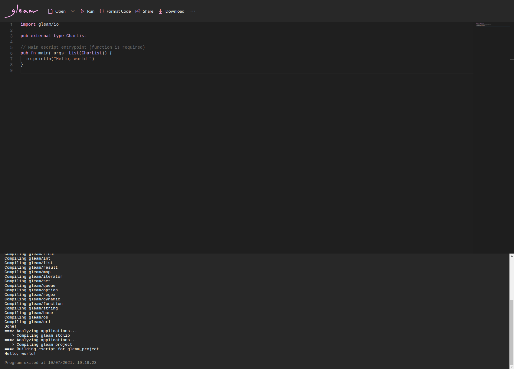

# A Gleam playground

This is a playground for running snippets of [Gleam](https://gleam.run) code in the browser. This project is based on the excellent [go-playground](https://github.com/x1unix/go-playground) by [x1unix](https://github.com/x1unix). Most of the frontend remain the same as in the original project, while the backend that actually compiles and runs the written Gleam code has been switched out with [OpenFaaS](https://www.openfaas.com/) running functions written in Python using the [FastAPI](https://fastapi.tiangolo.com/) framework. 

## Playground website

The Gleam playground can be accessed [here](https://nicklas.xyz/apps/gleam-playground).

## Deployment instructions

TODO
